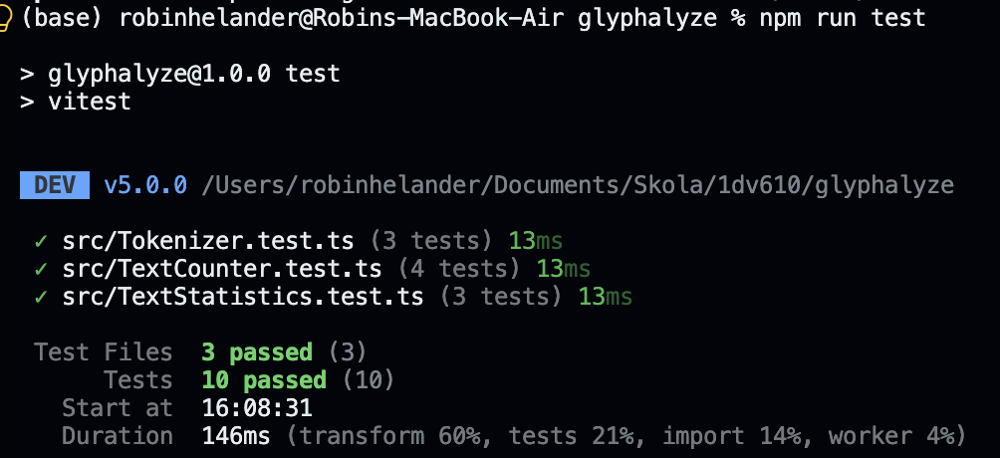

# Test Report


## Summary

I have chosen to use unit testing using Vitest. To me this was the most obvious solution since the functions are pure: they have no side effects and always return the same output for the same input. That means each test only needs a fixed input and an expected value calculated by hand, without any setup or mocking, and the tests can run in any order. This gives me the benefit of easily seeing if something breaks during development. I would say testing each function was more or less equally hard, other than for obejcts i had to use `toEqual(...)` rather than `toBe(...)`

### Run tests

The tests can be found `src/` *.test.ts

1. Clone repo
```bash
git clone https://github.com/Twodrop/glyphalyze.git
cd glyphalyze
```

2. Install:

```bash
npm install
```

3. Run the tests:

```bash
npm run test:run
```

### Output



## Test Results

**Example** (shows what a filled-in row can look like — remove this example table before
submitting):

| What was tested                                                        | How it was tested                                                                                                       | Result                                                                       |
| ------------------------------------------------------------------------ | --------------------------------------------------------------------------------------------------------------------- | ------------------------------------------------------------------------------ |
| `Jpeg.load(path)` returns a `Picture` instance for a valid image file. | Automated unit test (Vitest): loaded `test-image.jpg` and checked that the return value had `getHeight()`/`getWidth()` methods. | ✅ Passed.                                                                    |
| `Picture.getPixelAt(x, y)` with coordinates outside the image.         | Manual test via the Test-App's interface: entered a coordinate pair larger than the image's width/height and observed the output. | ❌ Didn't throw an error initially — fixed, now throws a clear exception. |

**Your test results:**

| What was tested | How it was tested | Result |
| --------------- | ------------------ | ------- |
| `TextCounter.countWords()` | passed the text `'Hello! Not really sure what i should write here but i guess this will do.'` and checked that it returned `15`. |✅ Passed.|
| `TextCounter.countCharacters()` | passed the text `'Six Seven'` and checked that it returned `9`, so the space counts as a character. |✅ Passed.|
| `TextCounter.countSentences()` | passed the text `'Hello my name is Robin. What is your name?'` and checked that it returned `2`. |✅ Passed.|
| `TextCounter.wordFrequency()` | passed the text `'Hej hej hej! Hallå'` and used `toEqual` to check that it returned `{ hej: 3, hallå: 1 }`. This covers case-insensitivity, punctuation and the letter `å`. |✅ Passed.|
| `TextStatistics.avgWordLength()` | passed a 19-word text containing `!`, `?` and `;` and checked that it returned `81 / 19`, which I calculated by hand. |✅ Passed.|
| `TextStatistics.avgSentenceLength()` | passed three sentences ending in `!`, `?` and `.` (20 words in total) and checked that it returned `20 / 3`. |✅ Passed.|
| `TextStatistics.readingTime()` | passed a 23-word text with a reading speed of `23` words per minute and checked that it returned `60` seconds. |✅ Passed.|
| `Tokenizer.getWords()` | passed the text `'Hello, how are you? I am fine!'` and used `toEqual` to check that it returned `['Hello', 'how', 'are', 'you', 'I', 'am', 'fine']`, with the punctuation removed. |✅ Passed.|
| `Tokenizer.getCharacters()` | passed the text `'Hi 👍🏽'` and used `toEqual` to check that it returned `['H', 'i', ' ', '👍🏽']`, so the emoji with its skin-tone modifier counts as one character. |✅ Passed.|
| `Tokenizer.getSentences()` | passed the text `'Hello my name is Robin. What is your name?'` and used `toEqual` to check that it returned `['Hello my name is Robin. ', 'What is your name?']`. |✅ Passed.|